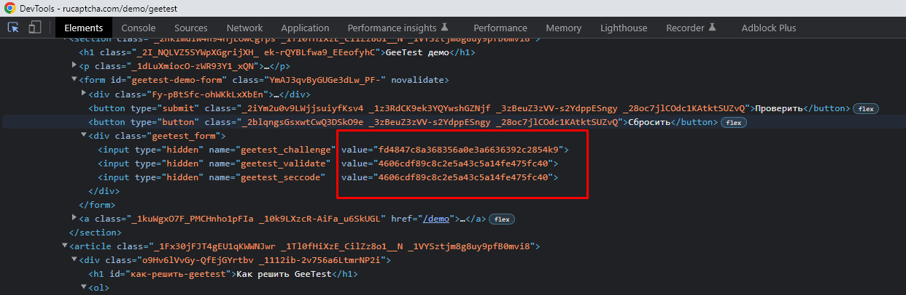

<u><b>[English](README.md)</b></u> | [Русский](README.ru.md)

# Example for solving of  GeeTest Captcha in Puppeteer

## How to start
### Cloning:
`git clone https://github.com/dzmitry-duboyski/GeeTest-demo.git`

### Installing dependencies:
`npm install`

### Set your apikey in `.env` file

### Start:
`npm run start`

---

## Description of the GeeTest solution algorithm:
1. Find captcha parameters `gt`, `challenge`, `api_server`:

    1.1. You can find the value of `gt` in the page code.
    Screenshot:
    

    1.2 Finding the meaning of `challenge` is a bit more difficult. 
    To do this, you need to find the request that the captcha makes on this page, this request must contain the value `challenge`.

    The response to the request will be in the following format:
    `{"success":1,"challenge":"21aaa1c62221631516179b492b9e80cc","gt":"81388ea1fc187e0c335c0a8907ff2625"}`. From this answer, you need to take the value `challenge`. 

    >If we consider the example with a captcha on the page [https://2captcha.com/demo/geetest](https://2captcha.com/demo/geetest?from=16653706), then in this case it will be a request to https://2captcha.com/api/v1/captcha-demo/gee-test/. The response to this request contains the required `challenge'.
    >Response: `{"success":1,"challenge":"21aaa1c62221631516179b492b9e80cc","gt":"81388ea1fc187e0c335c0a8907ff2625"}`.
    >
    >Screenshot:
    

    You can read more about the `challenge` on the [page](https://2captcha.com/p/geetest?from=16653706).

2. Sending captcha to API.

To solve the captcha, you need to send the found captcha parameters to the API:
```json
"key":"your_api_key",
"method":"geetest"
"pageurl":"https://2captcha.com/demo/geetest"
"gt": "81388ea1fc187e0c335c0a8907ff2625",
"challenge": "21aaa1c62221631516179b492b9e80cc"
```

3. Getting a answer for Captcha.

After successfully solving the captcha, the API will return a response with the solution. Example of a response with a solution from the API:
```json
{
   "status": 1,
   "request": {
       "geetest_challenge": "fd4847c8a368356a0e3a6636392c2854k9",
       "geetest_validate": "4606cdf89c8c2e5a43c5a14fe475fc40",
       "geetest_seccode": "4606cdf89c8c2e5a43c5a14fe475fc40|jordan"
   }
}
```

4. Using the solution.
The resulting values must be inserted into the corresponding html elements of the GeeTest captcha on the page.

Example:
```html
<div class="geetest_form">
  <input type="hidden" name="geetest_challenge" value="fd4847c8a368356a0e3a6636392c2854k9">
  <input type="hidden" name="geetest_validate" value="4606cdf89c8c2e5a43c5a14fe475fc40">
  <input type="hidden" name="geetest_seccode" value="4606cdf89c8c2e5a43c5a14fe475fc40">
</div>
```

Screenshot:


Done. After that, you can proceed to perform actions on the page. In this example, after that, the "Check" button is clicked. 

The source code is available in the file [index.js](/index.js)

### Additional information:
- [GeeTest Submission Documentation](https://2captcha.com/2captcha-api#solving_geetest?from=16653706).
- [Demo page with GeeTest](https://2captcha.com/demo/geetest?from=16653706).
- [Learn more about the GeeTest solving](https://2captcha.com/p/geetest?from=16653706).