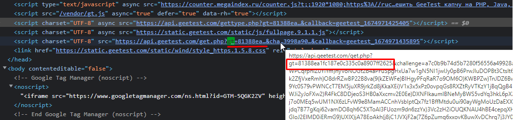
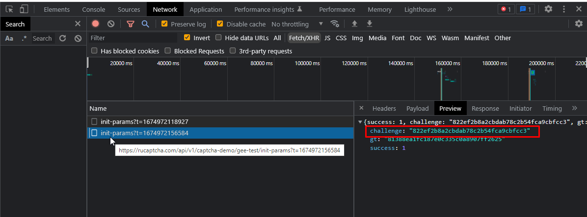
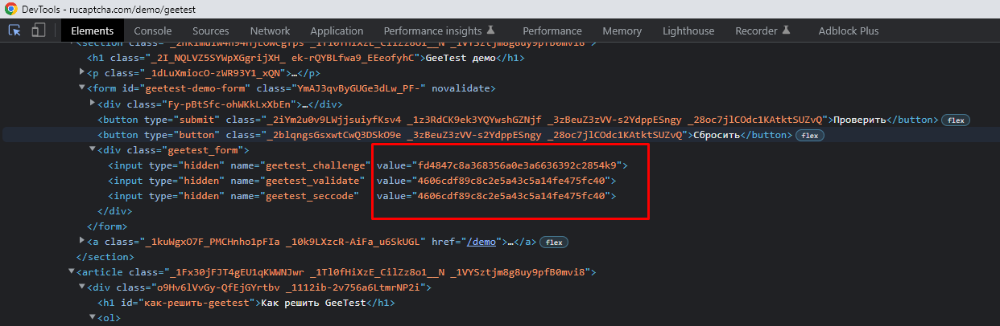

[English](README.md) | <u><b>[Русский](README.ru.md)</b></u>

# Решение капчи GeeTest в Puppeteer

## Запуск проекта
### Клонирование проекта:
`git clone https://github.com/dzmitry-duboyski/GeeTest-demo.git`

### Установка зависимостей:
`npm install`

### Укажите значение вашего APIKEY в файле `.env`.

### Запуск проекта:
`npm run start`

---

## Описание алгоритма решения GeeTest:
1. Найти параметры капчи `gt`, `challenge`, `api_server`:

    1.1. Найти значение `gt` можно в коде страницы.
    Скриншот:
    

    1.2 Найти значение `challenge` немного сложнее. 
    Для этого необходимо найти запрос, который делает капча на этой странице, этот запрос должен содержать значение `challenge`. 

    Ответ на запрос будет в следующем формате:
    `{"success":1,"challenge":"21aaa1c62221631516179b492b9e80cc","gt":"81388ea1fc187e0c335c0a8907ff2625"}`. Из этого ответа необходимо взять значение `challenge`. 

    >Если рассматривать пример с капчей на странице [https://2captcha.com/demo/geetest](https://2captcha.com/demo/geetest?from=16653706), то в этом случае это будет запрос к https://2captcha.com/api/v1/captcha-demo/gee-test/. Ответ на этот запрос содержит необходимый `challenge`.
    >Ответ: `{"success":1,"challenge":"21aaa1c62221631516179b492b9e80cc","gt":"81388ea1fc187e0c335c0a8907ff2625"}`.
    >
    >Скриншот:
    

    Подробнее про challenge можно почитать [тут](https://2captcha.com/p/geetest?from=16653706).

2. Отправка капчи в API.

Для решения капчи, необходимо отправить в API найденные параметры капчи:
```json
"key":"your_api_key",
"method":"geetest"
"pageurl":"https://2captcha.com/demo/geetest"
"gt": "81388ea1fc187e0c335c0a8907ff2625",
"challenge": "21aaa1c62221631516179b492b9e80cc"
```

3. Получение решения капчи.

После успешного решения капчи, API вернет ответ с решением. Пример ответа с решением от API:
```json
{
   "status": 1,
   "request": {
       "geetest_challenge": "fd4847c8a368356a0e3a6636392c2854k9",
       "geetest_validate": "4606cdf89c8c2e5a43c5a14fe475fc40",
       "geetest_seccode": "4606cdf89c8c2e5a43c5a14fe475fc40|jordan"
   }
}
```

4. Применение решения.
Полученные значения необходмо вставить в соответствующие html элементы GeeTest капчи на странице.

Пример:
```html
<div class="geetest_form">
  <input type="hidden" name="geetest_challenge" value="fd4847c8a368356a0e3a6636392c2854k9">
  <input type="hidden" name="geetest_validate" value="4606cdf89c8c2e5a43c5a14fe475fc40">
  <input type="hidden" name="geetest_seccode" value="4606cdf89c8c2e5a43c5a14fe475fc40">
</div>
```

Скриншот:


Готово. После этого можно переходить к выполнению действий на странице. В этом примере после этого происходит нажатие на кнопку "Проверить". 

Код решения доступен в файле [index.js](/index.js)

## Дополнительная информация:
- [Документация по отправке GeeTest](https://2captcha.com/2captcha-api#solving_geetest?from=16653706).
- [Демо страница c GeeTest](https://2captcha.com/demo/geetest?from=16653706) с описанием решения.
- [Подробнее о решении GeeTest](https://2captcha.com/p/geetest?from=16653706)