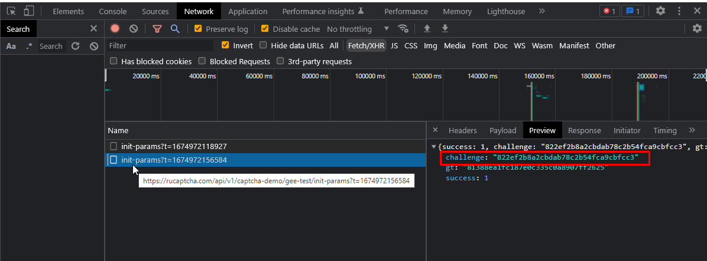

[English](README.md)  | <b>[中国语文科](README.zh.md)</b> | [Русский](README.ru.md)


# 描述如何使用Puppeteer通过GeeTest检查

## 如何打开项目
### 克隆:
`git clone https://github.com/dzmitry-duboyski/GeeTest-demo.git`

### 安装依赖项:
`npm install`

### 在中输入API密钥的值 `.env`文件。

### 推出:
`npm run start`

---
>[Geetest](https://www.geetest.com/)安全平台用於許多流行網站。 在本手冊中，描述瞭如何成功使用[2Captcha](https://2captcha.com/?from=16653706)和[Puppeteer](https://pptr.dev/)服務進行[Geetest](https://www.geetest.com/)安全檢查。 為了成功檢查支票，您必須在[2captcha.com](https://2captcha.com/?from=16653706)服務中擁有一個帳戶。


此示例描述瞭如何在演示頁面上破解geetest [https://2captcha.com/demo/geetestest](https://2captcha.com/demo/geetestest?from=16653706)


## 解决GeeTest的动作顺序：
1. 在網站頁面上找到Geetest參數 `gt`, `challenge`, `api_server`:

    1.1. 您可以在頁面代碼中找到`gt`的值。

    截屏：
    

    1.2 尋找`challenge`有點複雜。
    為此，您需要在此頁面上找到該請求，此請求必須包含`challenge`的值。

    該請求的答案將採用以下格式：
    `{"success":1,"challenge":"21aaa1c62221631516179b492b9e80cc","gt":"81388ea1fc187e0c335c0a8907ff2625"}`. 从这个答案中，有必要采取`challenge`的价值。

    >在页面[https://2captcha.com/demo/geetest](https://2captcha.com/demo/geetest?from=16653706)上，这将是https://2captcha.com/api/api/v1/captcha-demo/gee-test/。对此请求的响应包含必要的`challenge`。

    >回答： `{"success":1,"challenge":"21aaa1c62221631516179b492b9e80cc","gt":"81388ea1fc187e0c335c0a8907ff2625"}`.
    >
    >截屏：
    

    您可以阅读有关“challenge”的更多信息[此页面](https://2captcha.com/p/geetest?from=16653706)

2. 将GeeTest发送到API。

要求解验证码，有必要将GeeTest参数发送到API。 参数：
```json
"key":"your_api_key",
"method":"geetest"
"pageurl":"https://2captcha.com/demo/geetest"
"gt":"81388ea1fc187e0c335c0a8907ff2625",
"challenge":"21aaa1c62221631516179b492b9e80cc"
```

3. 得到答案：

接下来，[2captcha](https://2captcha.com/?from=16653706)服务将解决captcha，API将返回包含答案的响应（GeeTest解决方案）。 包含GeeTest溶液的示例:
```json
{
   "status": 1,
   "request": {
       "geetest_challenge": "fd4847c8a368356a0e3a6636392c2854k9",
       "geetest_validate": "4606cdf89c8c2e5a43c5a14fe475fc40",
       "geetest_seccode": "4606cdf89c8c2e5a43c5a14fe475fc40|jordan"
   }
}
```

4. 如何处理解决方案？
结果值必须插入到包含此"GeeTest"的页面上的相应"html"元素"GeeTest"中。

例子：
```html
<div class="geetest_form">
  <input type="hidden" name="geetest_challenge" value="fd4847c8a368356a0e3a6636392c2854k9">
  <input type="hidden" name="geetest_validate" value="4606cdf89c8c2e5a43c5a14fe475fc40">
  <input type="hidden" name="geetest_seccode" value="4606cdf89c8c2e5a43c5a14fe475fc40">
</div>
```

截图:


完成了。 之后，您可以继续在页面上执行操作。 在此示例中，之后单击"检查"按钮。 

源代码可在文件[index.js](/index.js)

## 其他资料:
- [使用"GeeTest"指南](https://2captcha.com/2captcha-api#solving_geetest?from=16653706).
- [该页面包含"GeeTest"的演示版本](https://2captcha.com/demo/geetest?from=16653706).
- [关于GeeTest解决方案的详细信息](https://2captcha.com/p/geetest?from=16653706)